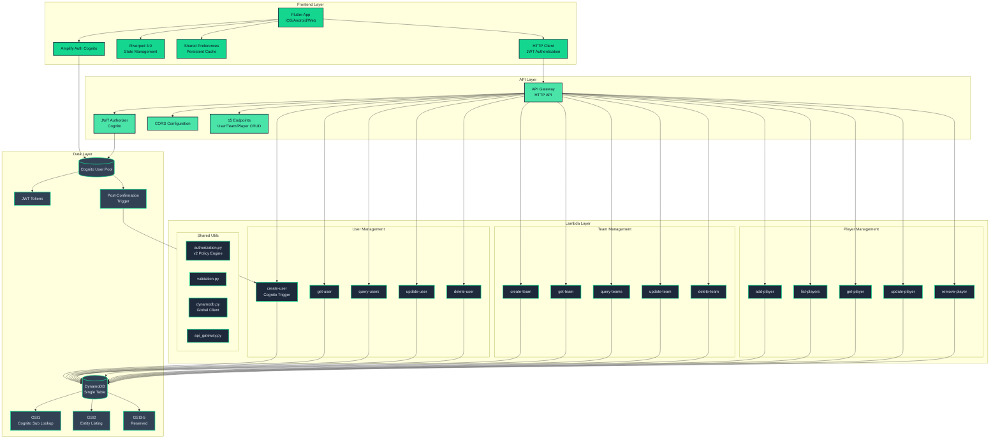
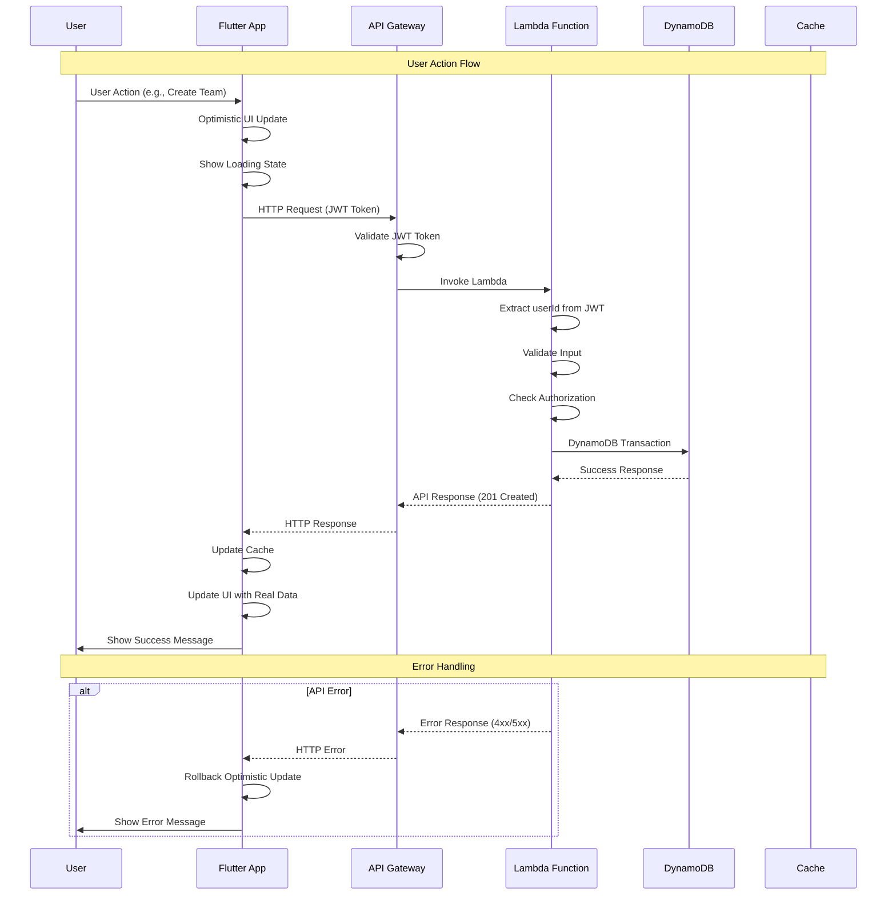
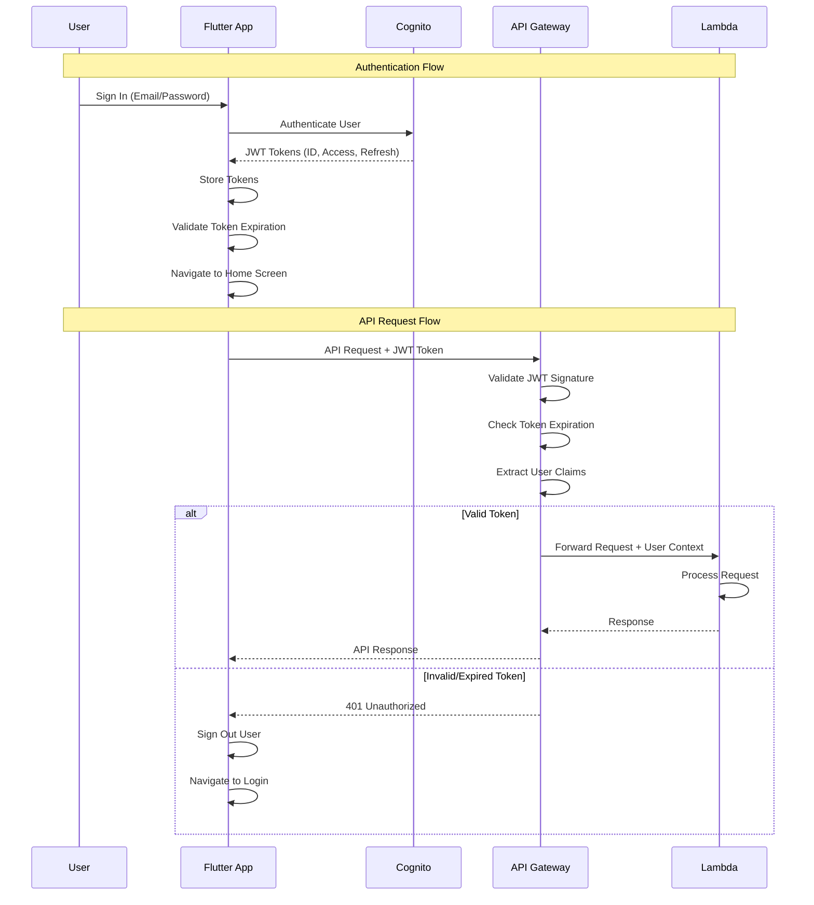
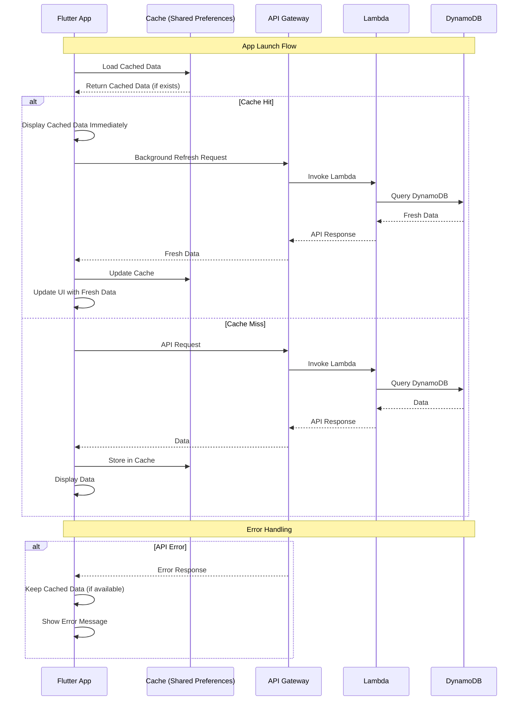
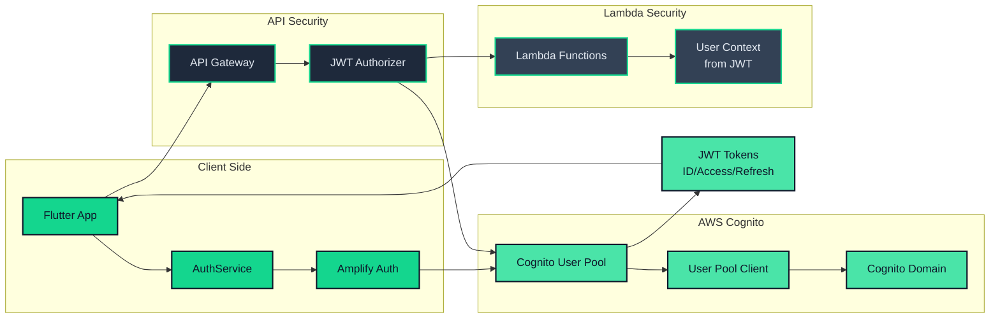
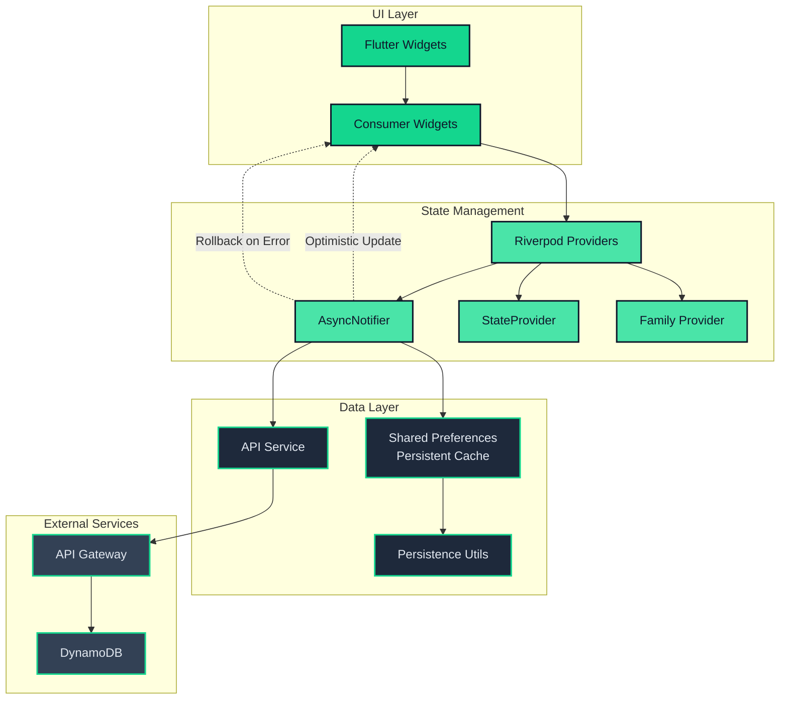

# Architecture Diagrams

**Part of:** [ARCHITECTURE.md](./ARCHITECTURE.md) - Complete system design and integration patterns

This document provides visual representations of HackTracker's architecture using both Mermaid diagrams (for detailed views) and ASCII diagrams (for quick reference).

---

## Table of Contents

1. [System Overview](#system-overview)
2. [Data Flow Diagrams](#data-flow-diagrams)
3. [Authentication Flow](#authentication-flow)
4. [State Management Flow](#state-management-flow)
5. [ASCII Diagrams](#ascii-diagrams)

---

## System Overview

### Complete System Architecture



---

## Data Flow Diagrams

### Request Flow (User Action to Response)



### Authentication Flow



### Caching Strategy Flow



---

## Authentication Flow

### Complete Authentication Architecture



---

## State Management Flow

### Riverpod State Management Architecture



---

## ASCII Diagrams

### Quick Reference Architecture

```
┌─────────────────────────────────────────────────────────────────┐
│                        HackTracker Architecture                  │
└─────────────────────────────────────────────────────────────────┘

┌─────────────────┐    ┌─────────────────┐    ┌─────────────────┐
│   Flutter App   │    │   API Gateway   │    │ Lambda Functions│
│                 │    │                 │    │                 │
│ • iOS/Android   │───▶│ • HTTP API      │───▶│ • User CRUD     │
│ • Web           │    │ • JWT Auth      │    │ • Team CRUD     │
│ • Riverpod 3.0  │    │ • CORS          │    │ • Player CRUD  │
│ • Persistent    │    │ • 15 Routes     │    │ • v2 Policy    │
│   Cache         │    │                 │    │   Engine        │
└─────────────────┘    └─────────────────┘    └─────────────────┘
         │                       │                       │
         │                       │                       │
         ▼                       ▼                       ▼
┌─────────────────┐    ┌─────────────────┐    ┌─────────────────┐
│   Cognito       │    │   DynamoDB      │    │   Shared        │
│   User Pool     │    │   Single Table  │    │   Preferences   │
│                 │    │                 │    │                 │
│ • JWT Tokens    │    │ • PK/SK Design  │    │ • Cache v1.0.0  │
│ • Post-Confirm  │    │ • GSI1-5        │    │ • SWR Pattern   │
│   Trigger       │    │ • Personal      │    │ • Optimistic    │
│                 │    │   Teams         │    │   Updates       │
└─────────────────┘    └─────────────────┘    └─────────────────┘
```

### Request Flow

```
User Action → Flutter UI → Optimistic Update
     ↓
API Call (JWT) → API Gateway → JWT Authorizer
     ↓
Lambda → authorize() → DynamoDB
     ↓
Response → Update Cache → Update UI
```

### Authentication Flow

```
App Launch → Token Validation → Valid?
     ↓ Yes                    ↓ No
Home Screen              Login Screen
     ↓
API Request → JWT Token → API Gateway
     ↓
Lambda → Extract User → Process Request
```

### State Management Flow

```
UI Widget → Consumer → Provider → AsyncNotifier
     ↓
Cache Check → Show Cached → Background Refresh
     ↓
API Call → Update Cache → Update UI
```

### Data Model Overview

```
DynamoDB Single Table Design:

PK (Partition Key)          SK (Sort Key)           Entity Type
─────────────────          ──────────────          ────────────
USER#<userId>              METADATA                User Profile
USER#<userId>              TEAM#<teamId>           Team Membership
TEAM#<teamId>              METADATA                Team Profile
TEAM#<teamId>              PLAYER#<playerId>       Player Profile

Global Secondary Indexes:
GSI1: COGNITO#<sub>        USER                    User Lookup
GSI2: ENTITY#<type>        METADATA#<id>          Entity Listing
GSI3-5: Reserved for future features
```

### Lambda Function Overview

```
User Management (5 functions):
├── create-user    (Cognito Trigger)
├── get-user       (GET /users/{userId})
├── query-users    (GET /users)
├── update-user    (PUT /users/{userId})
└── delete-user    (DELETE /users/{userId})

Team Management (5 functions):
├── create-team    (POST /teams)
├── get-team       (GET /teams/{teamId})
├── query-teams    (GET /teams)
├── update-team    (PUT /teams/{teamId})
└── delete-team    (DELETE /teams/{teamId})

Player Management (5 functions):
├── add-player     (POST /teams/{teamId}/players)
├── list-players   (GET /teams/{teamId}/players)
├── get-player     (GET /teams/{teamId}/players/{playerId})
├── update-player  (PUT /teams/{teamId}/players/{playerId})
└── remove-player  (DELETE /teams/{teamId}/players/{playerId})
```

---

## Technology Stack Summary

### Frontend
- **Framework:** Flutter 3.9+ with Dart 3.9+
- **State Management:** Riverpod 3.0+
- **Authentication:** AWS Amplify Auth Cognito
- **Caching:** Shared Preferences with SWR pattern
- **UI:** Material 3 with custom theming

### Backend
- **API:** AWS API Gateway HTTP API
- **Functions:** AWS Lambda (Python 3.13, ARM64)
- **Database:** DynamoDB Single Table Design
- **Authentication:** Cognito JWT Authorizer
- **Infrastructure:** Terraform

### Key Features
- **Optimistic UI:** Race-condition-safe updates
- **Persistent Caching:** Session-retained data
- **Authorization:** v2 Policy Engine
- **Personal Teams:** Auto-created for each user
- **Global DynamoDB Client:** Warm-start optimization

---

## Summary

These diagrams provide comprehensive visual representations of HackTracker's architecture:

- **System Overview:** Complete system architecture with all components
- **Data Flow:** Request/response patterns and error handling
- **Authentication:** JWT-based security flow
- **State Management:** Riverpod patterns and caching strategy
- **ASCII Diagrams:** Quick reference for common patterns

The architecture supports **scalable development** with **clear separation of concerns** and **robust error handling** while maintaining **performance** and **user experience** standards.
